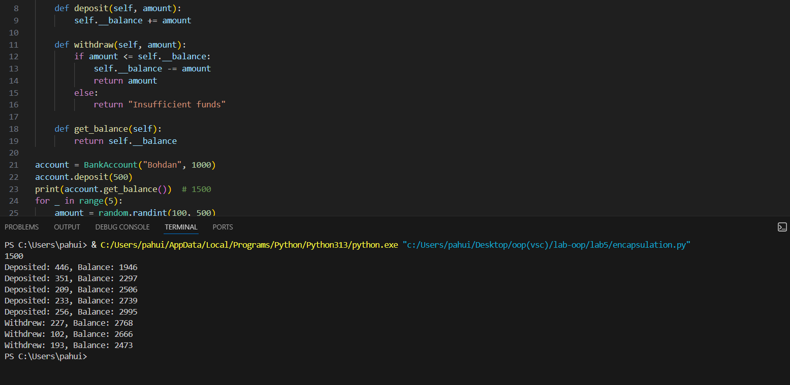
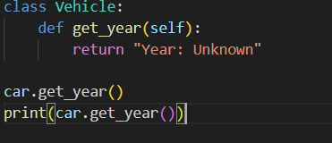
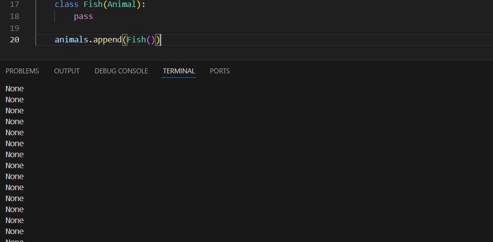
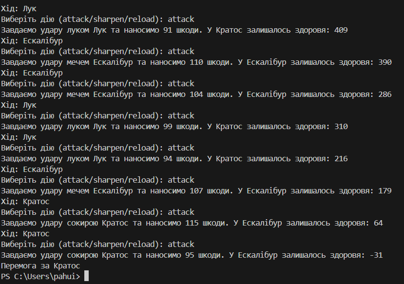

# Лабораторна робота №5
## Тема: Основні парадигми ООП
### Мета роботи: Ознайомитись з ключовими поняттями об’єктно-орієнтованого програмування (ООП) у Python та навчитися реалізовувати їх у власних класах на прикладі ігрової симуляції.

---
### Виконання роботи
* Результати виконання завдання №1;
    1. Отримано наступні результати 
* Результати виконання завдання №2;
    1. Отримано наступні результати 
* Результати виконання завдання №3;
    1. Отримано наступні результати 
    2. видає значення None
* Результати виконання завдання №4;
    1. Отримано наступні результати 

---
### Висновок: Підчас виконання лабораторної рооти ознайомився з ключовими поняттями об’єктно-орієнтованого програмування (ООП) у Python та навчився реалізовувати їх у власних класах на прикладі ігрової симуляції.
