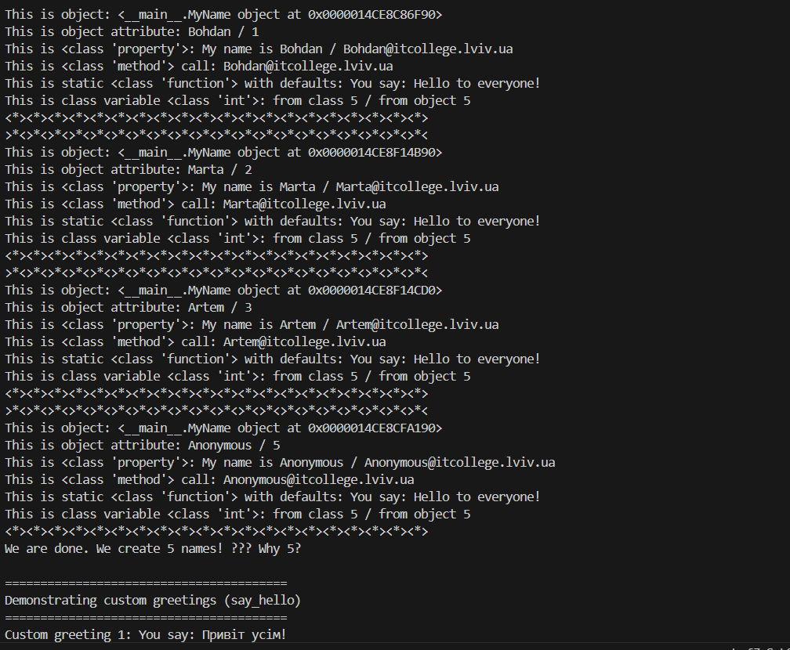
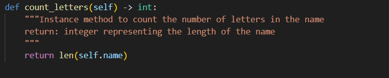
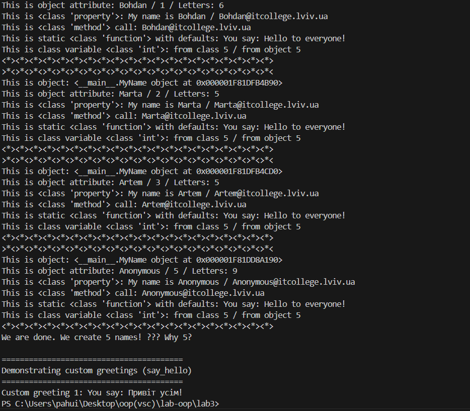
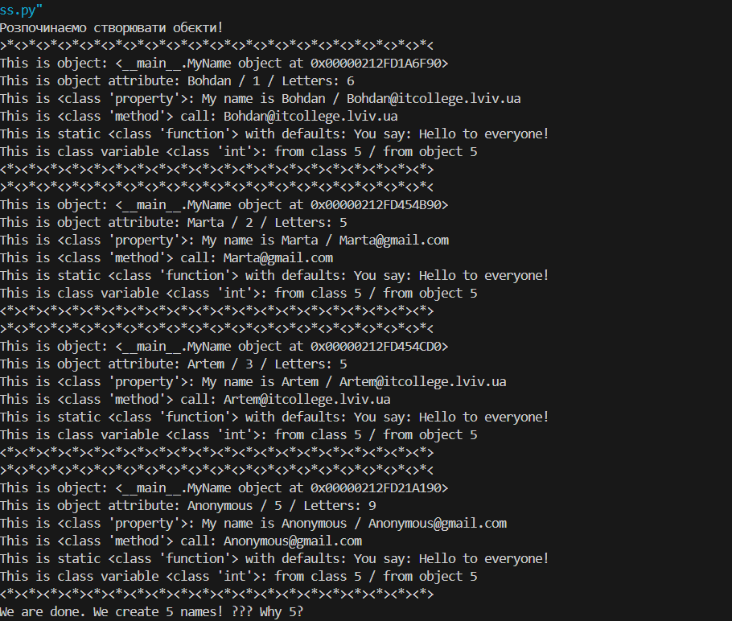
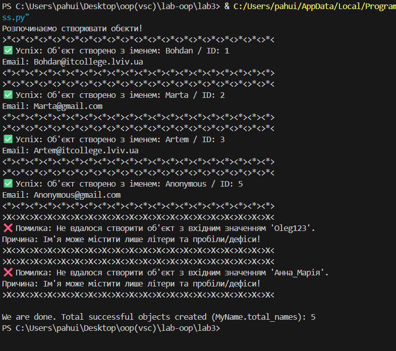
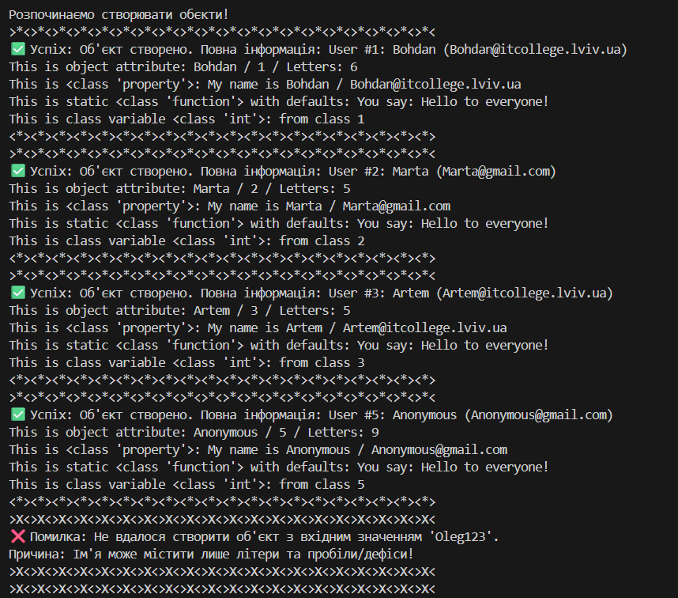
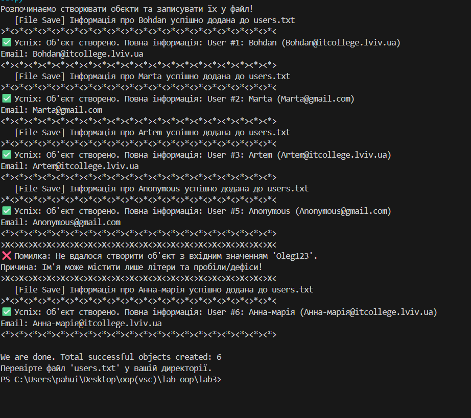
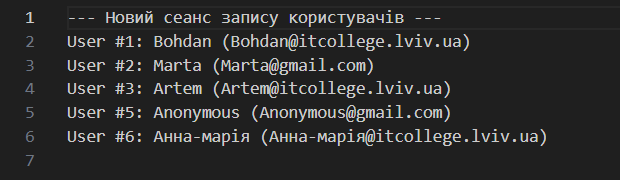

# Звіт до роботи
## Тема: _Знайомство з ООП_
### Мета роботи: _Навчитись використовувати основні принципи ООП, розглянути кострукції побудови класу та створення обєктів та навчитись працювати з ним_

---
### Виконання роботи
* Результати виконання завдання;
    1. після створення файлу py_class.py вставив запропонований код і отримав такий результат
   

* вставлений код / текстовий або числовий результат / інші результати:
    - так можна вставляти код, або просто вствляйте посилання на файл з програмою;
    ```python
    def simple_function_example():
        pass
    ```
    - якщо потрібно виділити текст, тоді:
    ```text
    << Тут можна писати те що хочемо виокремити >>
    ```

* результати виконання індивідуального завдання (якщо такі є);

---
### Висновок:
- :question: Чому коли передаємо значення None створюється обєкт з іменем Anonymous?
   - У ря дку 10 ми маємо перевірку підчас якої, якщо ми отримуємо значення NONE то викликається метод класу self.anonymous_user().
  
 ```python
    self.name = name if name is not None else self.anonymous_user().name
```

- :question: Як змінити текст привітання при виклику методу say_hello()? Допишіть цю частину коду.
  
  - оскільки значення say_hello() є сталим нам треба його змінити, або новим рядком назначити йому інше значення.
- :question: Допишіть функцію в класі яка порахує кількість букв імені (підказка: використайте функцію len());
    
- це результат:

- :question: Порахуйте кількість імен у списку names та порівняйте із виведеним результатом. Дайте відповідь чому маємо різну кількість імен?
  - Через те що ми маємо значення NONE: коли викликаємо конструктор MyName.total_name +=1 спрацьовує і отримуємо 4, але чере те що в нас значення NONE виконується else і при призначені імені anonymous функція MyName.total_name +=1 викликається ще раз і ми отримуємо значення 5
- :question: модифікуйте конструктор init, щоб значення self.name завжди починалося з великої літери, навіть якщо користувач ввів маленьку.
  - при додавані .capitalize() в рядок self.name = (name if name is not None else self.anonymous_user().name) ми отримуємо що завжди ім'я починається з великої літери.
- :question: змініть метод create_email так щоб можна було модифікувати значення після @;
  
  - я змінив так щоб якщо виводяться імена Marta i Anonymous було @gmail.com, а в інших випадках @itcollege.lviv.ua
- :question: додайте перевірку: якщо ім’я містить цифри або символи, підніміть помилку
ValueError("Ім'я може містити лише літери!").
    - для того щоб це здійснити я додав ще один метод 
    ```python
    #  1. ВИКЛИКАЄМО МЕТОД ВАЛІДАЦІЇ
        self._validate_name(initial_name)

        self.name = initial_name
        self.domain = domain
    #  2. НОВИЙ МЕТОД ДЛЯ ПЕРЕВІРКИ ІМЕНІ
    def _validate_name(self, name: str):
        """Перевіряє, чи містить ім'я лише літери, пробіли та дефіси.
           Піднімає ValueError, якщо знайдено цифри або символи.
        """
        if re.search(r'[^a-zA-Zа-яА-ЯіІїЇєЄ\s\-]', name):
            raise ValueError("Ім'я може містити лише літери та пробіли/дефіси!")
    ```
    - це результат:

  
- :question: додайте нову властивість full_name, яка повертає результат у форматі:
"User #<id>: <name> (<email>)"
  - для цього я додав:
    ```python
        @property
        def full_name(self) -> str:
            """Class property
            return: Повертає повну інформацію про користувача: "User #<id>: <name> (<email>)"
            """
            # Створюємо потрібний формат рядка, використовуючи атрибути екземпляра
            return f"User #{self.my_id}: {self.name} ({self.my_email})"
    ```
    - та змінив вивід на:
    ```python
       print(f"""{">*<"*20}
    ✅ Успіх: Об'єкт створено. Повна інформація: {obj.full_name} 
    This is object attribute: {obj.name} / {obj.my_id} / Letters: {obj.count_letters()}
    This is {type(MyName.whoami)}: {obj.whoami} / {obj.my_email}
    This is static {type(MyName.say_hello)} with defaults: {obj.say_hello()} 
    This is class variable {type(MyName.total_names)}: from class {MyName.total_names}
    {"<*>"*20}""")
    ```
  - це результат:

- question: реалізуйте метод save_to_file(filename="users.txt"), який додає рядок із записом у файл;
    - для цього я додав новий метод 
  ```python
       def save_to_file(self, filename="users.txt"):
        """Метод екземпляра, який додає рядок із записом (full_name) у вказаний файл.
        Використовує режим 'a' (append) для додавання.
        """
        record = self.full_name
        try:
            # Використовуємо 'with open' для безпечної роботи з файлом
            with open(filename, 'a', encoding='utf-8') as f:
                f.write(record + '\n') # Додаємо рядок і перехід на новий рядок
            print(f"   [File Save] Інформація про {self.name} успішно додана до {filename}")
        except IOError as e:
            print(f"   [File Error] Не вдалося записати у файл {filename}: {e}")
    ```
    - та додав виклик цього методу 
  ```python
       for name in names_to_test:
    try:
        obj = MyName(name)
        key = obj.name if name is not None else name
        all_names[key] = obj
        
        
        obj.save_to_file()
    ```
    - це результат:
  
  
## Одже підчас виконання роботи я навчився додавати нові методи змінювати вивід за допомогою підходу ооп та застосовувати його
